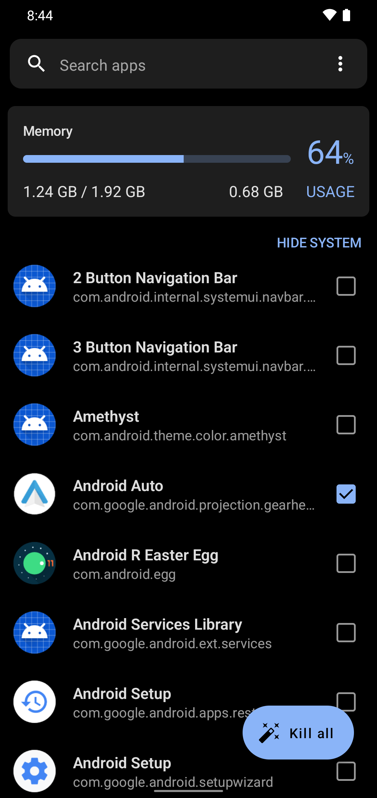
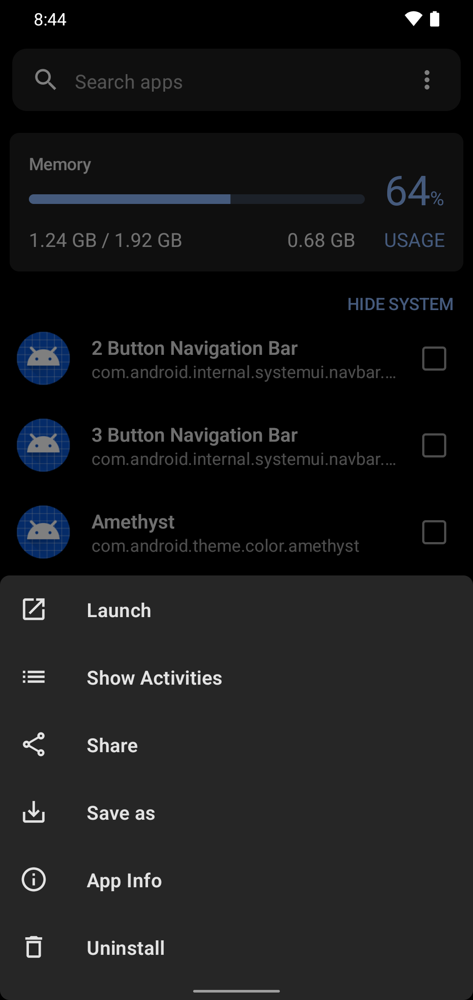
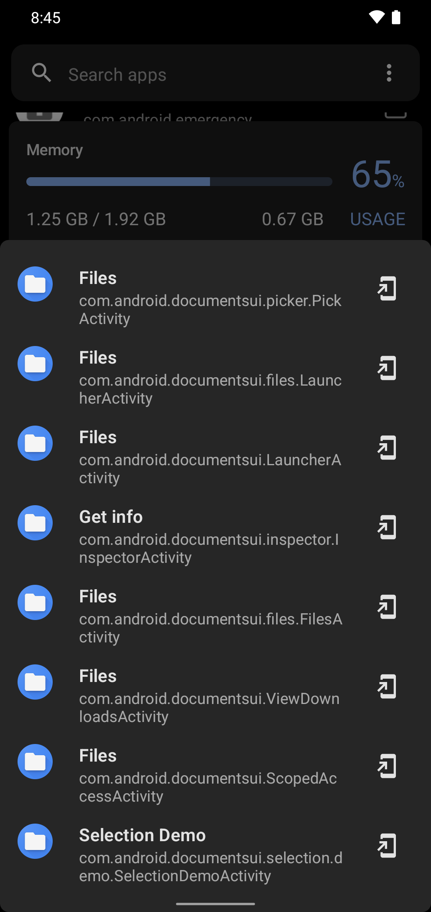
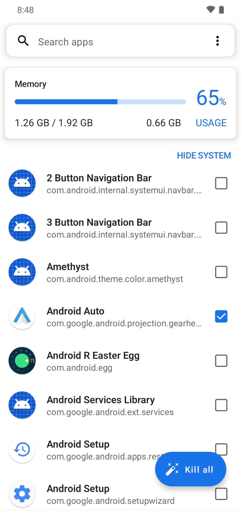
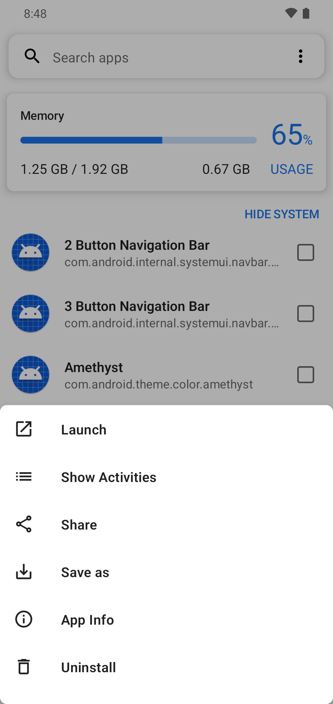

# Helper

An App killer, App activities explorer, App apk extractor

Packed App activities launcher, Memory monitor and App Killer into 1 App to help developers during development.

Leveraged accessibility-service to simulate a user click and 3+ different heuristics to put the app in stopped state.

Currently available on the Play Store.

## Screenshots

    
    
    
    
    

## Contributing Bug reports

Use either GitLab or GitHub for filing a bug report.
Please search the existing issues for your bug and create a new one if the issue is not yet tracked!

GitLab:
https://gitlab.com/karthek/Helper/-/issues

GitHub:
https://github.com/karthek-git/Helper/issues

## Joining the Beta

Want to live life on the bleeding edge and help out with testing?

You can subscribe to Helper Beta releases here:
https://play.google.com/apps/testing/com.karthek.android.s.helper

For stability, stick with the public releases.

## Contributions

If you've found a bug in this app, please file an issue.

Patches are encouraged and may be submitted by forking this project and
submitting a pull request. Since this project is still in its very early stages,
if your change is substantial, please raise an issue first to discuss it.

## Help

For troubleshooting and questions, please write to me at mail@karthek.com

## License

Copyright 2023 Karthik Alapati

Licensed under the Apache-2.0: https://www.apache.org/licenses/LICENSE-2.0.txt

For more details, See [.reuse/dep5](https://gitlab.com/karthek/Helper/-/blob/master/.reuse/dep5)

Google Play and the Google Play logo are trademarks of Google LLC.
